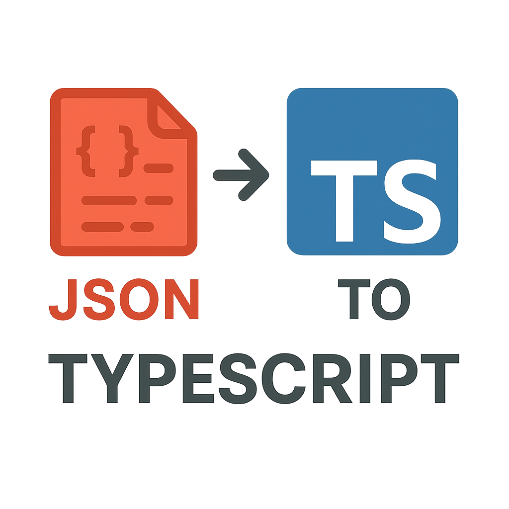

# JsonToTypescript 🔄

Convert raw JSON into clean, readable TypeScript types or interfaces in seconds.

## Features

- **One-step generation**: paste JSON and press Enter to generate a `.ts` file
- **Readable names**: nested types are named from JSON keys
    - e.g. `profile` → `Profile`, `projects` → `Project[]`, `settings.notifications` → `Notifications`
- **Smart inference**:
    - `null` becomes `any` (and `any` dominates unions)
    - ISO-like date strings become `string | Date`
    - Arrays of short token-like strings become string-literal unions, e.g. `("admin" | "editor")[]`
- **File naming**: output file uses the model name lowercased, e.g. `User` → `user.ts`
- **No dependencies**: single-file Node CLI

## Installation

### Clone the repository:
```bash
git clone https://github.com/KevinG115/JsonToTypescript.git
cd JsonToTypescript
```

### Install dependencies (for development only):
```bash
npm install
```

### Run the CLI directly with Node:
```bash
node json-2-typescript.js
```

### Or link it globally for local testing:
```bash
npm link
json-to-typescript
```

Now you can run `json-to-typescript` from anywhere on your machine.

## Usage

### Interactive Mode
```bash
json-to-typescript
# Prompts:
# Model name (e.g., User, OrderItem): User
# Paste JSON and press Enter when done:
# { ...your JSON... }
# => generates user.ts in the current directory
```

### Command Line Arguments
```bash
json-to-typescript --model-name Order --input-json ./order.json
```

### Options
- `--interface` → generate `interface` instead of `type`
- `--no-dates` → don't convert ISO strings to `Date`
- `--no-color` → plain log output
- `--out path.ts` → specify output file path

## Example

### Input JSON:
```json
{
  "id": 123,
  "name": "Patrick",
  "profile": { "bio": "Dev", "age": 30 },
  "tags": ["typescript", "node"]
}
```

### Output:
```typescript
export type Profile = {
    age: number;
    bio: string;
};

export type User = {
    id: number;
    name: string;
    profile: Profile;
    tags: ("typescript" | "node")[];
};
```

## Contributing

PRs welcome!

### Steps for contributing:
1. Fork the repo
2. Create a feature branch (`git checkout -b feature/my-feature`)
3. Make your changes to `json-2-typescript.js`
4. Test your changes: `npm run dev`
5. Lint and format: `npm run prepare`
6. Commit changes (`git commit -m 'Add my feature'`)
7. Push branch (`git push origin feature/my-feature`)
8. Open a PR

## Development

```bash
# Install dependencies
npm install

# Development mode with auto-reload
npm run dev

# Format and lint code
npm run format
npm run lint:fix

# Check everything before committing
npm run prepare
```

## Roadmap

- **Nested file output** → split models into multiple `.ts` files instead of one big file
- **JSON → Java** → Generate POJOs with optional Lombok annotations
- **JSON → Rust** → Generate `struct`s with optional `serde` annotations for serialization
- **JSON → Python** → Generate Pydantic models (ideal for FastAPI and modern Python backends)
- **Java → TypeScript** → Translate existing Java POJOs into matching TypeScript interfaces with config file support to specify which POJOs to include for translation
- **VS Code extension** → right-click JSON → Generate TypeScript Interface
- **Web playground** → paste JSON in browser → copy TS interface

## License

MIT © Kevin Gleeson